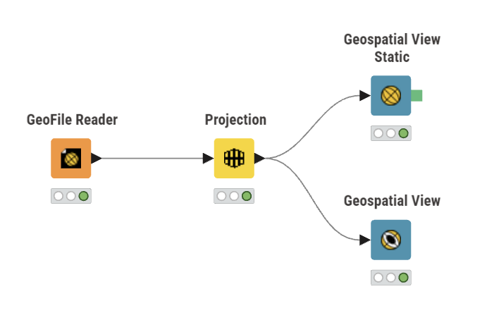

This In-class Exercise is learning Geospatial Data processing with KNIME

# Workflow

The KNIME workflow was constructed to import, project and visualise the geospatial dataset.

{width="80%"}

### Data Import

The **GeoFile Reader** node was used to import the geospatial dataset.

### Coordinate Transformation

The **Projection** node was used to transform the coordinate reference system before spatial analysis and visualisation.

### Visualisation

Both static and interactive geospatial views were explored to inspect the spatial distribution of the dataset.
